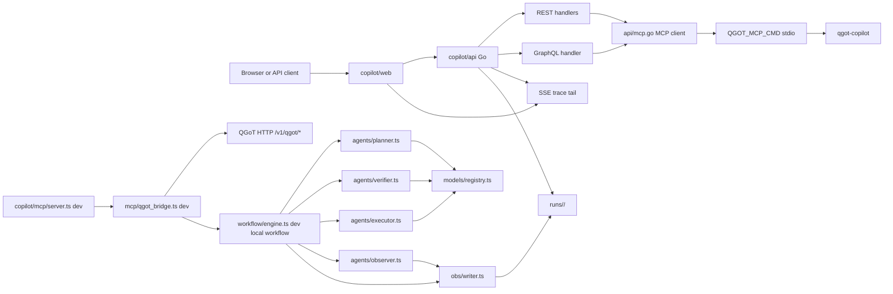

# Copilot architecture

This document describes the implemented `copilot/` stack. The root Opseeq gateway in `../../service/` is a separate process with separate routes and artifacts.

## Runtime boundary

`copilot/` has three local processes during development:

| Process | Default | Code | Role |
|---|---:|---|---|
| Go API | `127.0.0.1:7100` | `api/main.go`, `api/*.go` | REST, GraphQL, SSE, metrics, and MCP proxy. |
| TypeScript MCP development server | stdio and optional `127.0.0.1:7102/rpc` | `mcp/server.ts` | Development JSON-RPC tool server for `qgot.*`; not the production Go API fallback path. |
| Web UI | `127.0.0.1:7101` | `web/*` | Prompt, status, model binding, run history, and event UI. |

The production Go API requires the QGoT MCP stdio command configured by `QGOT_MCP_CMD`. The optional QGoT Rust HTTP service is outside this directory and is expected at `QGOT_HTTP_BASE`, default `http://127.0.0.1:7300`, when used directly for readiness/reference checks.

## Source layout

```text
copilot/
  api/        Go REST, GraphQL, SSE, metrics, MCP proxy
  agents/     TypeScript planner, verifier, executor, observer, coder
  workflow/   Local plan -> verify -> execute state machine
  models/     Provider adapters and role model registry
  mcp/        TypeScript JSON-RPC MCP server and QGoT bridge
  obs/        Run event schema and file writer
  store/      Prisma schema and Docker Compose for Postgres
  web/        Vite browser UI
  runs/       File-backed run artifacts
  bench/      Smoke and API integration scripts
  docs/       Copilot documentation
```

The sibling QGoT Rust service files used by the bridge are under `../../../QGoT/rust/qgot/src/`, including `copilot_contracts.rs`, `gateway.rs`, and `bin/qgot_copilot.rs`.

## Component graph



## Request flows

### Submit prompt over REST

1. `web/api.ts` calls `POST /v1/copilot/prompt`.
2. `api/rest.go` calls MCP tool `qgot.execute` through `api/mcp.go`.
3. `api/mcp.go` wraps the request as JSON-RPC `tools/call` and invokes `QGOT_MCP_CMD`.
4. The QGoT MCP stdio gateway returns an MCP result with `structuredContent`.
5. The Go API returns the run envelope to the client or returns a `502` integration error if QGoT MCP fails.
6. The web UI opens `GET /v1/copilot/runs/sse/{id}` to stream `trace.ndjson` when a file-backed run exists.

### Read status

1. Web UI calls `GET /v1/copilot/qgot/status`.
2. `api/rest.go` calls MCP tool `qgot.status` through `api/mcp.go`.
3. `api/mcp.go` invokes `QGOT_MCP_CMD` and unwraps `structuredContent`.
4. If QGoT MCP is unavailable, the route returns `ok:false`, `source:"opseeq.api"`, `status:"qgot_status_unavailable"`, and the command error for operator visibility.
5. `web/main.ts` renders ready, degraded, or offline cards from the returned status envelope.

### Query GraphQL

1. Client posts to `POST /graphql`.
2. `api/graph.go` lowercases the query text and dispatches by substring.
3. Mutations and model/status queries call MCP tools.
4. `run(id)` and `runs` read `state.json` from the configured run directory.
5. Unsupported queries return a hint to inspect `/graphql/schema`.

### Stream events

1. Client opens `GET /v1/copilot/runs/sse/{id}`.
2. `api/sse.go` validates the run id with `isSafeRunID`.
3. It waits briefly for `trace.ndjson` to exist.
4. It streams each NDJSON line as `data: ...` and emits keep-alive pings while waiting for new lines.

## API boundary

| File | Public behavior |
|---|---|
| `api/rest.go` | `/healthz`, `/readyz`, `/v1/copilot/qgot/status`, prompt submit, run lookup, event file serving, model bindings, run control. |
| `api/graph.go` | Hand-written GraphQL endpoint and SDL. |
| `api/sse.go` | Server-sent event tail over run trace files. |
| `api/proxy.go` | JSON-RPC proxy to the QGoT MCP stdio command configured by `QGOT_MCP_CMD`. |
| `api/metrics.go` | Metrics endpoint behavior. |
| `api/security_test.go` | Run id safety constraints. |
| `api/config.go` | Loads `.env`, optional QGoT `.env`, API host/port, `QGOT_MCP_CMD`, MCP timeouts, run directory, and QGoT base URL. |

GraphQL is intentionally minimal and does not implement subscriptions. Event streaming is SSE over REST.

## Production MCP boundary

The Go API production MCP boundary is implemented in `api/mcp.go`.

- `QGOT_MCP_CMD` is required.
- `Call` and `CallTool` send JSON-RPC to the configured command over stdio.
- `CallTool` unwraps MCP `structuredContent` and accepts text content only when it is valid JSON.
- `/mcp/rpc` forwards a raw JSON-RPC request to the same command.
- There is no production fallback to the TypeScript MCP server, QGoT HTTP, or `workflow/engine.ts`.

## TypeScript MCP development boundary

`mcp/server.ts` supports JSON-RPC methods:

- `initialize`
- `ping`
- `tools/list`
- `tools/call`

Tools exposed:

| Tool | Development behavior |
|---|---|
| `qgot.plan` | QGoT HTTP/MCP or local `PlannerAgent.plan` when running the TypeScript server directly. |
| `qgot.verify` | QGoT HTTP/MCP or local `VerifierAgent.verify` when running the TypeScript server directly. |
| `qgot.execute` | QGoT HTTP/MCP or local `WorkflowEngine.submit` when running the TypeScript server directly. |
| `qgot.observe` | QGoT run/status endpoints or local pause/resume/redirect event recording. |
| `qgot.qal.simulate` | QGoT QAL endpoint or offline message. |
| `qgot.models` | QGoT model bindings or development `ModelRegistry` operations. |
| `qgot.status` | QGoT readiness or a TypeScript development unavailable envelope. |

## TypeScript QGoT bridge

Implemented in `mcp/qgot_bridge.ts`.

Development bridge order when the TypeScript MCP server is run directly:

1. QGoT HTTP copilot endpoints under `/v1/qgot/copilot/*`.
2. Compatibility endpoints such as `/v1/qgot/pipelines`, `/v1/qgot/qal/simulate`, `/v1/qgot/observability/status`, and `/v1/qgot/runs/{run_id}`.
3. `QGOT_MCP_CMD` when configured and bridge mode allows MCP.
4. Local TypeScript workflow behavior owned by `mcp/server.ts`.

Environment controls:

| Variable | Purpose |
|---|---|
| `QGOT_HTTP_BASE` | Base URL for QGoT HTTP service. |
| `QGOT_MCP_CMD` | Shell command used to run QGoT MCP over stdio. |
| `QGOT_BRIDGE_MODE` | `auto`, `http`, `mcp`, or `local`. |
| `QGOT_BRIDGE_TIMEOUT_MS` | Fast status/plan/model timeout. |
| `QGOT_BRIDGE_EXECUTE_TIMEOUT_MS` | Longer execute/pipeline/QAL timeout. |

The TypeScript bridge normalizes remote QGoT payloads into Opseeq copilot `Plan`, `Verification`, `TaskRun`, and `RunEnvelope` shapes defined in `obs/schema.ts`. The production Go API does not depend on this bridge for fallback execution.

## Local workflow

Implemented in `workflow/engine.ts`.

State progression:

```text
PLANNING -> VERIFYING -> EXECUTING -> DONE|FAILED
```

Behavior:

- Creates a ULID run id.
- Attaches an `ObserverAgent` to the run writer.
- Calls planner and writes a plan artifact.
- Calls verifier and writes verification artifacts.
- Re-plans until approval or `maxRejections` is exceeded.
- Executes tasks from the approved plan.
- Finishes as `DONE` only when every task run has status `DONE`; otherwise `FAILED`.

Observer controls are active-run controls only. Redirect writes `RedirectedByObserver` and an observer record; it does not mutate the already-running linear submit loop into a new prompt execution.

## Persistence

| Data | Writer/reader | Location | Notes |
|---|---|---|---|
| Run envelope | `obs/writer.ts`, `api/rest.go`, `api/graph.go` | `runs/<run_id>/state.json` | File-backed source used by REST and GraphQL run reads. |
| Event stream | `obs/writer.ts`, `api/sse.go` | `runs/<run_id>/trace.ndjson` | SSE tails this file. |
| Plans | `obs/writer.ts` | `plan.json`, `plans.ndjson` | Latest plan and all plan iterations. |
| Verifications | `obs/writer.ts` | `verify.json`, `verify.ndjson` | Latest verification and all verifier outputs. |
| Task records | `obs/writer.ts` | `exec.jsonl` | Task run status and outputs. |
| Observer records | `obs/writer.ts` | `observer.jsonl` | Drift, pause, resume, redirect, and observer entries. |
| Coder output | `obs/writer.ts` | `coder.jsonl` | Written when coder entries are produced. |
| Engine logs | `obs/writer.ts` | `log.txt` | Text log lines. |
| Database schema | `store/schema.prisma` | Postgres | Schema and migrations target; current run API reads are file-backed. |

## Model registry

Implemented in `models/registry.ts`.

Providers registered at runtime:

- `nvidia`
- `ollama`
- `openai`
- `kimi`
- `qwen`
- `mock`

Default role bindings are derived from env vars and can be changed at runtime through `qgot.models`. The local registry stores those changes in memory. Do not document model binding changes as durable Postgres state unless persistence code is added.

## Web UI

Implemented in `web/main.ts`, `web/api.ts`, `web/index.html`, and `web/styles.css`.

UI access points:

- Prompt submission and run summary.
- QGoT readiness summary and bridge indicator.
- Protocol check cards for HTTP, MCP, GraphQL, OpenAPI, QAL, executor, model roles, run store, ORM, OODA, and frontend when reported by QGoT status.
- Role binding list/edit controls.
- Run history cards with plan, verification, task, and drift counts.
- SSE timeline that prepends streamed trace events.

The UI treats unavailable/offline QGoT status as an inspectable operator state and keeps raw readiness payloads visible.

## Validation sources

| Validation | Source |
|---|---|
| TypeScript lint/typecheck | `package.json`, `Makefile` |
| Go tests and vet | `api/*.go`, `Makefile` |
| Run id path safety | `api/security_test.go` |
| MCP selftest | `mcp/selftest.ts` |
| Smoke/API integration | `bench/smoke.sh`, `bench/api_integration.sh` |
| Web build | `web/package.json` |

Use `make qc` for the copilot quality gate.
