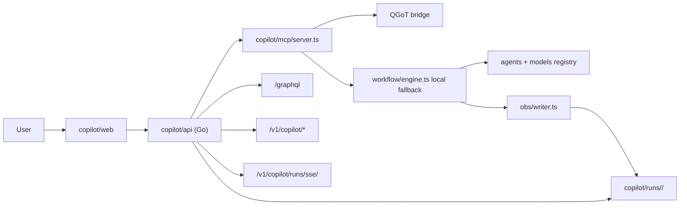

# Copilot system trace

This trace maps the implemented Opseeq Copilot stack from user action to service boundary, storage, events, and approval state.

## Current architecture

Opseeq Copilot is a separate local stack under `copilot/`.

The Rust QGoT service is preferred when available through `QGOT_HTTP_BASE`. If it is unavailable and `QGOT_BRIDGE_MODE=auto`, the TypeScript workflow is used as the local fallback.

## Workflow trace

| User action | Frontend | API route | Backend path | Artifact/output | Approval state |
|---|---|---|---|---|---|
| Submit prompt | `web/main.ts` prompt tab | `POST /v1/copilot/prompt` | Go API -> `qgot.execute` MCP tool -> QGoT bridge or `WorkflowEngine.submit()` | `runs/<id>/state.json`, `trace.ndjson`, `plans.ndjson`, role logs | No file-diff approval UI yet; verifier approves/rejects plan |
| Watch run | `streamRun()` EventSource | `GET /v1/copilot/runs/sse/<id>` | Go SSE tails `trace.ndjson` | SSE `RunEvent` stream | Read-only |
| Inspect run list | Runs tab | `GET /v1/copilot/runs` | Go API reads `runs/*/state.json` | Run envelopes | Read-only |
| Inspect one run | REST or GraphQL | `GET /v1/copilot/runs/<id>`, `query run(id)` | Go API reads `state.json` | One run envelope | Read-only |
| Pause run | `controlRun()` | `POST /v1/copilot/runs/control` | `qgot.observe` -> `engine.pause()` | `PausedByObserver` when handled locally | Operator control, in-memory local fallback |
| Resume run | `controlRun()` | `POST /v1/copilot/runs/control` | `qgot.observe` -> `engine.resume()` | `ResumedByObserver` when handled locally | Operator control, in-memory local fallback |
| Redirect run | `controlRun()` | `POST /v1/copilot/runs/control` | `qgot.observe` -> `engine.redirect()` | `RedirectedByObserver` when handled locally | Operator control, in-memory local fallback |
| List models | Models tab | `GET /v1/copilot/models` | `qgot.models` MCP tool | Runtime role bindings | Read-only |
| Set role model | Models tab | `PUT /v1/copilot/models` or GraphQL `setRoleModel` | `registry().setRole()` or remote QGoT model contract | Runtime role binding response | Operator control; durable Postgres write is not current source of truth |
| Check QGoT readiness | UI/API caller | `GET /v1/copilot/qgot/status` | `qgot.status` | Readiness JSON with source/fallback reason | Read-only |
| Get metrics | API caller | `GET /v1/copilot/metrics/summary` | Go API scans `runs/*/state.json` | Counts and `drift_max` | Read-only |

## Event and artifact files

Each run writes files under `copilot/runs/<run_id>/`:

| File | Meaning |
|---|---|
| `prompt.txt` | Original prompt |
| `plan.json` | Latest plan |
| `plans.ndjson` | All plan iterations |
| `verify.json` | Latest verifier verdict |
| `verify.ndjson` | All verifier verdicts |
| `exec.jsonl` | Task execution records |
| `coder.jsonl` | Coder dispatch output |
| `observer.jsonl` | Observer heartbeats and drift probes |
| `trace.ndjson` | Complete event stream |
| `log.txt` | Human-readable run log |
| `state.json` | Latest run envelope |

## Implemented feedback states

| State | Source | Accessible UI requirement |
|---|---|---|
| `PLANNING` | Workflow state machine | Visible run status text |
| `VERIFYING` | Workflow state machine | Visible run status text and verifier event |
| `EXECUTING` | Workflow state machine | Visible run status text and task events |
| `PAUSED` | Observer control | Visible paused label and resume action |
| `DONE` | Run envelope | Visible success label |
| `FAILED` | Run envelope | Visible failure label and error detail |
| `DriftDetected` | Observer event | Non-color-only event label |

The current copilot web UI shows text events and status, but it is still minimal. It does not yet provide a Codex-like diff review, durable approval queue, or reversible file-change plan.

## Storage contract

`copilot/store/schema.prisma` defines a future Postgres-backed run store and model binding audit log. Current Go handlers read run state from the filesystem. Documentation and UI should not claim Postgres is the live source of truth for run envelopes until API handlers use it.

## Safety contract

- Copilot API and web should be treated as local-only surfaces.
- Run IDs are opaque directory names under `copilot/runs/`.
- QGoT bridge status must clearly report whether responses came from remote QGoT, an existing QGoT endpoint, or local fallback.
- Mock providers are valid for tests and smoke benches only; UI/docs must not present mock output as production model output.
