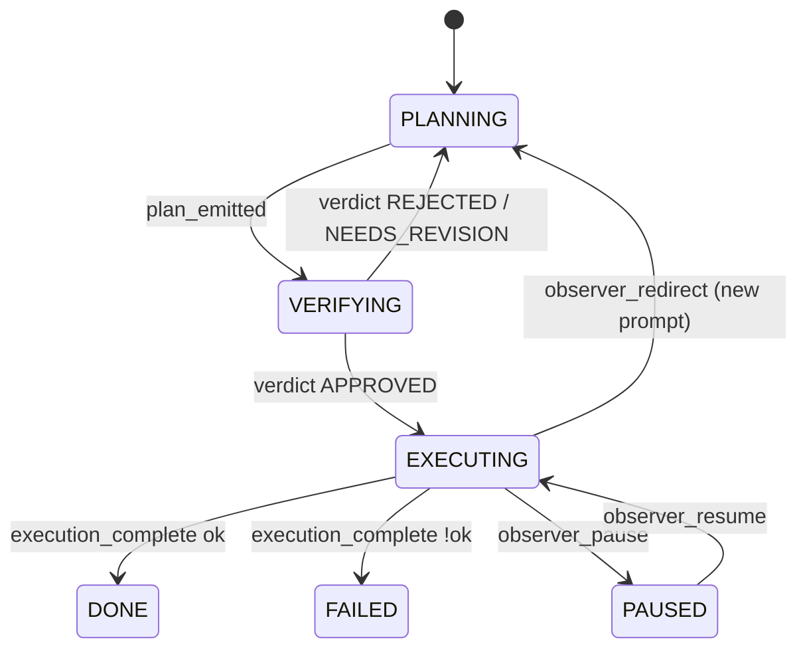
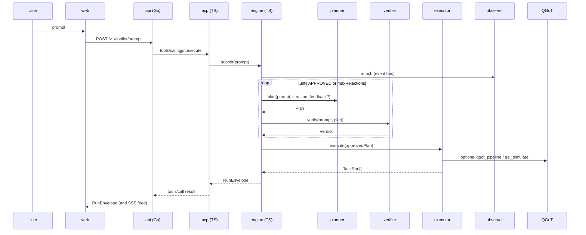

# Execution workflow

The workflow is implemented in `workflow/engine.ts`. It plans, verifies, executes, observes, and writes run artifacts. It does not yet provide a universal file-diff approval UI.

## State machine

## End-to-end sequence

## Re-plan loopback

- Verifier rejection sets `feedback = verification.reason`.
- Engine increments `iteration` and re-invokes Planner.
- Both plans are recorded with monotonically increasing `iteration`; the second plan is distinct in `runs/<id>/plans.ndjson`.
- After `maxRejections` (default 2) the run is marked `FAILED` and the user can `retryRun(id)`.

## Observer overrides (control plane)

| Action | Effect |
|---|---|
| `pause` | observer flips paused; executor’s next iteration short-circuits via `isPaused()` (v0.2 makes this hard-stop) |
| `resume` | clears paused flag |
| `redirect` | records `RedirectedByObserver` event; UI then issues a fresh `submitPrompt` with the new prompt |
| `ask_verifier` | observer's drift response can call the verifier as an alignment checker |

## Failure modes

- Provider unreachable → adapter throws → engine logs and marks run FAILED.
- Verifier returns malformed JSON → safe parser falls back to APPROVED with explicit reason `default-approve`. This is a fallback behavior and should be visible in UI/reports.
- Coder output truncated → `truncate()` records `…(+N)` suffix; full text remains in coder.jsonl.
- Drift > threshold → `DriftDetected` event recorded; a future iteration may auto-redirect (v0.2).

## Human approval status

Implemented:

- verifier approval/rejection before execution
- observer pause/resume/redirect control
- run artifacts for plan, verifier verdicts, tasks, observer events, and traces

Not implemented:

- durable approval queue
- file diff review before effectful edits
- universal reversible action plan
- persistent pause/resume state outside the current process
