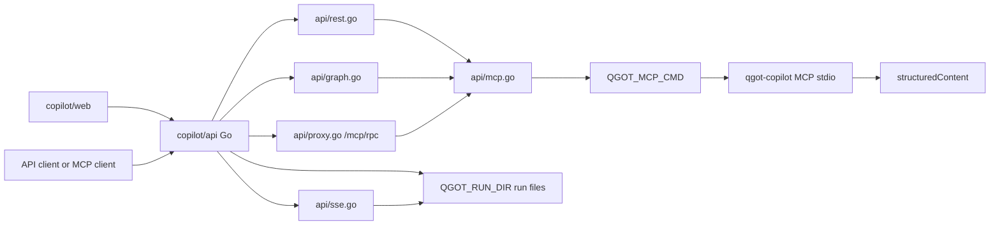

# Opseeq architecture

## Scope

This document describes the current code in this repository:

- `service/`: Opseeq HTTP gateway and MCP control plane.
- `dashboard/`: local operator dashboard and terminal bridge.
- `copilot/`: separate QGoT-backed copilot stack.
- `nemoclaw/`, `nemoclaw-blueprint/`, `bin/nemoclaw.js`, and `docs/`: inherited NemoClaw/OpenShell reference stack.

It does not claim that every connected service is always running. Mermate, Synth, Ollama, QGoT, NemoClaw, and AgentOS are probed or called when configured and are reported as degraded/offline when unavailable.

## Product intent

Opseeq is a local-first orchestration dashboard and gateway for coordinating configured AI providers, MCP tools, connected app adapters, QGoT copilot workflows, and human-reviewed precision actions on a developer workstation.

Implemented product utility:

- Route model requests through local and remote providers behind OpenAI-compatible routes.
- Show service readiness and integration state in a local dashboard.
- Expose MCP tools for gateway status, model calls, repo/app actions, graph queries, precision planning, Mermate/Synth calls, and browser-use helpers.
- Run precision/OODA planning and emit artifacts for review.
- Coordinate QGoT-backed copilot plan/verify/execute workflows from a separate copilot stack.
- Surface NemoClaw/OpenShell sandbox status and actions without making NemoClaw the Opseeq gateway itself.

Current limitations:

- Dashboard access is local by default and does not provide production auth on its own.
- Gateway artifact storage is split between an in-memory inference ring buffer and disk artifacts under `~/.opseeq-superior/`.
- Copilot run state is currently file-backed even though a Prisma schema exists.
- Precision approval is explicit in the precision request envelope; it is not a universal authorization layer over every gateway route.
- Redirect in the copilot observer records intent in the current TypeScript workflow; it does not restart the active linear run loop by itself.

## Runtime processes

| Process | Default address | Primary code | Responsibility |
|---|---:|---|---|
| Opseeq gateway | `0.0.0.0:9090` unless `OPSEEQ_HOST` is set | `service/src/index.ts` | Express routes, auth, rate limiting, model routing, MCP SSE, status aggregation, OODA/graph/artifact APIs, app/repo actions, Mermate/Synth/NemoClaw/AgentOS bridges. |
| Optional kernel | stdio child | `service/src/kernel.ts`, `engine/` if present | Optional JSON-RPC inference route. Gateway falls back to Node providers when unavailable. |
| Dashboard | `127.0.0.1:7070` | `dashboard/server.js`, `dashboard/public/*` | Operator UI, gateway proxy, app/NemoClaw controls, terminal WebSocket profiles. |
| Copilot API | `127.0.0.1:7100` | `copilot/api/*.go` | REST, GraphQL, SSE, metrics, and `/mcp/rpc` proxy for copilot workflows. Production QGoT calls go directly to `QGOT_MCP_CMD`. |
| Copilot TypeScript MCP/dev workflow | stdio and optional `127.0.0.1:7102/rpc` | `copilot/mcp/server.ts`, `copilot/workflow/*` | Development/local workflow tooling that remains in the tree; it is not the production fallback path for the Go API. |
| Copilot web | `127.0.0.1:7101` | `copilot/web/*` | Prompt, readiness, model bindings, run history, and event timeline UI. |
| QGoT MCP/HTTP service | stdio command from `QGOT_MCP_CMD`; optional HTTP at `127.0.0.1:7300` | sibling `QGoT/rust/qgot/src/*` | Authoritative QGoT `qgot.*` tools and readiness contracts consumed by the Copilot Go API. |

## Gateway architecture

```mermaid
flowchart LR
  C[Client or dashboard] --> G[service/src/index.ts]
  G --> AUTH[auth, rate limit, request id]
  G --> R[router.ts]
  R --> K[kernel.ts optional JSON-RPC]
  R --> P[configured HTTP providers]
  G --> MCP[mcp-server.ts]
  G --> STATUS[/api/status aggregation]
  G --> OODA[mermate-lucidity-ooda.ts]
  G --> LAG[living-architecture-graph.ts]
  G --> EXEC[execution-runtime.ts and pipeline routes]
  G --> APPS[repo-connect.ts and app-launcher.ts]
  G --> NC[nemoclaw-control.ts]
  OODA --> TS[trace-sink.ts]
  OODA --> TC[temporal-causality.ts]
  LAG --> TS
  R --> FB[feedback.ts ring buffer]
```

### Gateway request behavior

- `x-request-id` is copied to `req.id` when present and length is at most 64; otherwise a UUID is generated.
- Per-IP rate limiting is applied before route handlers.
- Bearer auth is required only when `OPSEEQ_API_KEYS` or `OPSEEQ_API_KEY` is configured.
- `Idempotency-Key` can deduplicate non-streaming chat completions. `OPSEEQ_IDEMPOTENCY_BODY_HASH=true` includes a body hash in the cache key.
- `POST /v1/chat/completions` resolves virtual aliases such as `nemotron:*` and `role:*` before routing.
- Streaming chat completions are forwarded as SSE; if the stream fails before headers are committed, the route attempts a non-streaming fallback.

### Gateway routes

The route list is implemented in `service/src/index.ts`.

| Area | Routes |
|---|---|
| Health and OpenAI compatibility | `GET /health`, `GET /health/ready`, `GET /v1/health`, `GET /v1/models`, `POST /v1/chat/completions`, `POST /v1/embeddings` |
| Gateway status and chat | `GET /api/status`, `GET /api/integrations`, `POST /api/chat`, `GET /api/connectivity`, `POST /api/connectivity/probe`, `GET /api/artifacts` |
| MCP | `GET /mcp`, `POST /mcp/messages` when enabled |
| Repo/app controls | `POST /api/repos/connect`, `POST /api/apps/open` |
| NemoClaw controls | `GET /api/nemoclaw/status`, `POST /api/nemoclaw/actions`, `POST /api/nemoclaw/default` |
| Precision and graph | `GET /api/ooda/extensions`, `GET /api/ooda/dashboard`, `GET /api/ooda/graph`, `GET /api/ooda/graph/search`, `GET /api/ooda/graph/node/:nodeId`, `POST /api/ooda/graph/refresh`, `POST /api/ooda/precision` |
| Mermate proxy | `GET /api/architect/status`, `POST /api/architect/pipeline`, `POST /api/builder/scaffold`, `/api/render*`, `/api/agent/modes`, `/api/agents`, `/api/copilot/health` |
| Execution and pipeline | `GET /api/absorption/status`, `POST /api/execution/bootstrap`, `POST /api/execution/route`, `GET /api/execution/tools`, `GET /api/execution/sessions`, `GET /api/pipeline/stages`, `GET /api/pipeline/mermate-vendor`, `POST /api/pipeline/session`, `POST /api/pipeline/execute`, `GET /api/pipeline/status/:sid` |
| Subagents and AgentOS | `GET /api/subagents/dashboard`, `POST /api/subagents/delegate`, `POST /api/subagents/assess`, `POST /api/subagents/cross-repo`, `GET /api/subagents/active`, `GET /api/subagents/task/:tid`, `GET/POST /api/agent-os/*` |
| Model aliases and residency | `POST /api/nemotron/resolve`, `GET /api/nemotron/aliases`, `GET /api/seeq/residency`, `POST /api/seeq/warmup`, `GET /api/seeq/roles` |

## Gateway MCP tools

Implemented in `service/src/mcp-server.ts`.

| Tool group | Tools |
|---|---|
| Gateway and inference | `opseeq_status`, `opseeq_chat`, `opseeq_connectivity_probe`, `inference`, `list_models`, `multi_inference`, `health_check` |
| Mermate and artifacts | `architect_status`, `architect_pipeline_build`, `builder_scaffold_repo`, `mermate_status`, `mermate_agent_modes`, `mermate_render`, `mermate_generate_tla`, `mermate_generate_ts`, `pipeline_orchestrate`, `artifact_verify` |
| Synth | `synth_status`, `synth_predict`, `synth_predictions`, `synth_markets`, `synth_portfolio` |
| Repos and desktop | `desktop_scan`, `repo_organize`, `browser_navigate`, `browser_interact` |
| Precision and graph | `precision_status`, `precision_plan`, `precision_dashboard`, `living_architecture_graph`, `living_architecture_search`, `living_architecture_node`, `living_architecture_refresh` |

MCP transport is SSE: `GET /mcp` creates a session and `POST /mcp/messages?sessionId=...` sends messages.

## Dashboard architecture

```mermaid
flowchart LR
  B[Browser] --> D[dashboard/server.js]
  D --> STATIC[dashboard/public]
  D --> PROXY[/api, /v1, /health proxy]
  PROXY --> G[Opseeq gateway]
  D --> LOCAL[dashboard/lib/local-control]
  D --> WS[WebSocket /terminal]
  WS --> PTY[dashboard/scripts/pty_bridge.py or shell fallback]
  LOCAL --> N[NemoClaw CLI/app controls]
```

Implemented dashboard access points:

- Static UI in `dashboard/public/index.html`.
- Main behavior in `dashboard/public/js/app.js`.
- Precision orchestration UI in `dashboard/public/js/precision-orchestration.js`.
- Local server routes for app registry, app inference/open, NemoClaw status/actions/default, runtime redeploy, `/session-info`, and proxies to the gateway.
- WebSocket terminal profiles: `opseeq-shell`, `execution-runtime`, `nemoclaw-connect`, and `nemoclaw-logs`.

## Precision/OODA flow

`POST /api/ooda/precision` calls `orchestratePrecisionPipeline` in `service/src/mermate-lucidity-ooda.ts`.

Inputs include:

- `intent`
- optional `repoPath` and `appId`
- `inputMode`, `maxMode`
- `approved`, `execute`
- `includeTla`, `includeTs`, `includeRust`
- `localModel`, `allowRemoteAugmentation`, `allowModelCritique`

Artifacts and graph updates are produced through:

- `service/src/trace-sink.ts`
- `service/src/temporal-causality.ts`
- `service/src/living-architecture-graph.ts`

Dashboard precision UI currently sends planning-style requests with `approved:false`, `execute:false`, `includeTla:true`, `includeTs:true`, and `includeRust:false` from `dashboard/public/js/precision-orchestration.js`.

## Copilot production architecture and API design

`copilot/` is not the root gateway process. The production Copilot API is the Go service in `copilot/api`. It talks to QGoT through the MCP stdio gateway command configured by `QGOT_MCP_CMD`. There is no production TypeScript, HTTP, or local workflow fallback in the Go API path.



Production MCP behavior in `copilot/api/mcp.go`:

- `NewMCPFromConfig` reads `QGOT_MCP_CMD`, `COPILOT_MCP_TIMEOUT_MS`, and `COPILOT_MCP_EXECUTE_TIMEOUT_MS`.
- `Call` wraps a method as JSON-RPC 2.0 and sends it to the configured command.
- `CallTool` calls `tools/call` and unwraps MCP `structuredContent` when present.
- `/mcp/rpc` forwards one raw JSON-RPC request body to the same command.
- Missing `QGOT_MCP_CMD` returns `QGOT_MCP_CMD is required for production QGoT MCP integration`.
- Command failures return `502` from Go API routes that depend on QGoT. The status route returns an explicit unavailable envelope for operator visibility, not a fallback execution path.

Production Copilot REST API:

| Route | Implementation | QGoT dependency |
|---|---|---|
| `GET /healthz`, `GET /readyz` | `api/rest.go` | None. |
| `GET /v1/copilot/qgot/status` | `api/rest.go` | Calls `qgot.status`. |
| `POST /v1/copilot/prompt` | `api/rest.go` | Calls `qgot.execute` with `{prompt}`. |
| `GET /v1/copilot/runs` | `api/rest.go` | Reads `state.json` files from `QGOT_RUN_DIR`. |
| `GET /v1/copilot/runs/{id}` | `api/rest.go` | Reads one run `state.json`; run id is restricted to alphanumeric, `_`, and `-`. |
| `GET /v1/copilot/runs/{id}/events` | `api/rest.go` | Serves `trace.ndjson` from `QGOT_RUN_DIR`. |
| `GET /v1/copilot/runs/sse/{id}` | `api/sse.go` | Tails `trace.ndjson` as SSE. |
| `GET /v1/copilot/models` | `api/rest.go` | Calls `qgot.models` with `action:list`. |
| `PUT /v1/copilot/models` | `api/rest.go` | Calls `qgot.models` with `action:set`. |
| `POST /v1/copilot/runs/control` | `api/rest.go` | Calls `qgot.observe`. |
| `GET /v1/copilot/metrics/summary` | `api/metrics.go` | Aggregates local run `state.json` files. |
| `POST /mcp/rpc` | `api/proxy.go` | Forwards raw JSON-RPC to `QGOT_MCP_CMD`. |

Production Copilot GraphQL API:

- `POST /graphql` is a hand-written dispatcher in `api/graph.go`, not a full GraphQL executor.
- `GET /graphql/schema` serves the SDL for tooling.
- `submitPrompt` calls `qgot.execute`.
- `setRoleModel` and `models` call `qgot.models`.
- `qgotStatus` calls `qgot.status`.
- `run(id)` and `runs` read local run files from `QGOT_RUN_DIR`.

The TypeScript MCP server and local workflow engine remain useful for development and historical compatibility, but the final production Go backend does not use them to recover from QGoT MCP failure.

## Persistence and trace boundaries

| Concern | Code | Storage | Durability |
|---|---|---|---|
| Gateway inference artifact ring | `service/src/feedback.ts` | Memory, exposed by `GET /api/artifacts` | Process-local only. |
| Gateway immutable artifacts | `service/src/trace-sink.ts` | `~/.opseeq-superior/artifacts/<task-id>/` | Disk files. |
| Gateway temporal causality | `service/src/temporal-causality.ts` | `~/.opseeq-superior/logs/temporal-causality.jsonl` plus artifact mirror | Disk files. |
| Living Architecture Graph | `service/src/living-architecture-graph.ts` | Graph/artifact files managed by module | Disk-backed module behavior. |
| Copilot run state | `copilot/obs/writer.ts`, `copilot/api/rest.go`, `copilot/api/graph.go` | `copilot/runs/<run_id>/` or `QGOT_RUN_DIR` | Disk files. |
| Copilot database schema | `copilot/store/schema.prisma` | Postgres when migrations are applied | Schema exists; current Go run reads use files. |
| Adaptive pipeline sessions | `service/src/index.ts`, `service/src/iterm2-adaptive-plug.ts` | In-memory `Map` | Process-local only. |

## Human-in-the-loop checkpoints

Implemented checkpoints are scoped, not global:

- Precision/OODA requests include approval and execution flags. The UI can request a plan without execution and display an approval envelope before action.
- NemoClaw/OpenShell network approvals are part of the inherited NemoClaw/OpenShell stack and are documented in NemoClaw docs, not enforced by the Opseeq gateway.
- Copilot observer controls expose pause, resume, and redirect actions through `qgot.observe`; the local redirect path records intent for follow-up rather than replacing the active workflow loop.
- App/repo routes validate inputs and path safety where implemented, but they are not a complete policy engine for arbitrary filesystem mutations.

## Service integration status

| Service | Current Opseeq behavior |
|---|---|
| Ollama | Probed through `OLLAMA_URL`; used as a configured provider and for residency warmup when available. |
| NVIDIA NIM | Configured through `NVIDIA_API_KEY`/`NVIDIA_BASE_URL` or local NIM variables; exposed as provider entries. |
| OpenAI/Anthropic/CoreThink | Configured as provider entries when keys are present. |
| Mermate | Probed and proxied through `MERMATE_URL`; routes forward render/TLA/TS/status requests. |
| Synth | Health-polled through `SYNTHESIS_TRADE_URL`; MCP tools call prediction/market/portfolio endpoints. |
| NemoClaw | Controlled through local CLI helpers for status, connect, logs, default sandbox, and terminal profiles. |
| QGoT | Consumed by the production Copilot Go API through required `QGOT_MCP_CMD`; optional HTTP `/v1/qgot/*` remains a sibling QGoT service surface and readiness/reference contract. |
| AgentOS | Gateway exposes status, VM, session, prompt, stop, list VMs, and list sessions routes through `service/src/agent-os.ts`. |

## Documentation boundaries

- Use `README.md` for setup and top-level route orientation.
- Use this document for implemented Opseeq architecture.
- Use `docs/INTEGRATION.md` for the broader integration manual while it is being reduced.
- Use `copilot/docs/*` for copilot-specific API, workflow, observability, and trace details.
- Use `docs/reference/*` for inherited NemoClaw/OpenShell behavior unless a page explicitly says it documents Opseeq gateway behavior.
