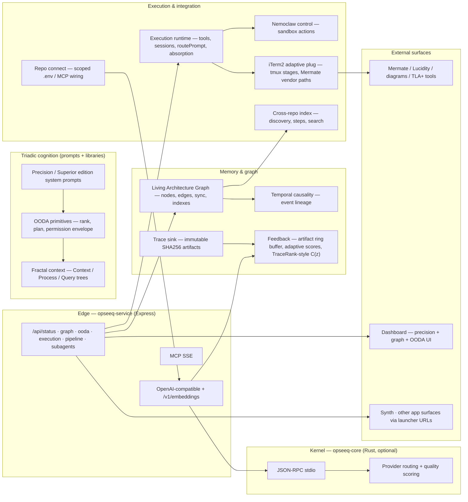

# Opseeq architecture

- **Date**: 2026-04-03
- **Type**: flowchart (Mermaid)
- **Scope**: Repository as implemented — Node service, optional Rust kernel, dashboard, configs, and integration contracts.

## Overview

Opseeq is a **local-first** supervisory stack: a **Node.js HTTP gateway** (`opseeq-service`) exposes an OpenAI-compatible API, MCP, embeddings, and `/api/*` control planes. **Inference is multi-provider** (Ollama, OpenAI-compatible endpoints, Anthropic, and others via `service` config and env) — the architecture does **not** center on any single external “reasoning product”; routing and policy live in Opseeq. An optional **Rust runtime kernel** (`opseeq-core`, JSON-RPC over stdio) handles deterministic routing and provider orchestration when the binary is present; otherwise the gateway runs in **Node fallback**. **Precision Orchestration** (and related edition prompts) enforce **OODA-shaped** planning: observe → orient → decide → act, with **explicit permission scopes** before effectful work. **General-Clawd** execution is modeled through the **execution runtime** (tools, sessions, routing) and may drive **iTerm2/tmux** pipeline stages when those tools exist. **Mermate**-centric flows use **Lucidity / MAX / formal** bridges; cross-repository awareness comes from **cross-repo indexing** and the **Living Architecture Graph** (persisted graph with provenance-style edges and capped backlink inference).

## Canonical data and control flow

## Layered view (implementation-aligned)

| Layer | Role | Primary implementation |
| ----- | ---- | ---------------------- |
| **1 — Edge & compatibility** | HTTP, CORS, per-IP rate limit, `Idempotency-Key` LRU, `x-request-id`, `/api/status` aggregation | `service/src/index.ts`, `config.ts` |
| **2 — Inference routing** | Multi-provider resolution (exact + prefix), streaming/non-streaming retry parity, embeddings provider selection, optional kernel handoff | `router.ts`, `provider-resolution.ts`, `http-fetch-retry.ts`, `kernel.ts`, `engine/` |
| **3 — Triadic core** | Linked Context / Process / Query structure; OODA cycles with ranked actions and permission gates | `fractal-context.ts`, `ooda-primitives.ts`, `config/*.system-prompt.md` |
| **4 — Architecture graph & cross-repo** | Versioned graph JSON, mtime cache + indexes, backlink cap + inverted index pruning, queries, dashboard text | `living-architecture-graph.ts`, `cross-repo-index.ts` |
| **5 — Provenance & observability** | Immutable artifacts, temporal trees, recent inference artifacts, concentration-style metrics and tau thresholds | `trace-sink.ts`, `temporal-causality.ts`, `feedback.ts` |
| **6 — Execution & policy surface** | Tool pools, session persistence, Nemoclaw hooks, pipeline stage metadata, subagent delegation | `execution-runtime.ts`, `nemoclaw-control.ts`, `iterm2-adaptive-plug.ts`, `windsurf-subagent-orchestrator.ts` |
| **7 — Product integration** | MCP tools, app launcher URLs, repo connect, dashboard assets, Mermate precision pipeline orchestration | `mcp-server.ts`, `app-launcher.ts`, `repo-connect.ts`, `mermate-lucidity-ooda.ts`, `dashboard/` |

## Master chain (precision orchestration)

Human **intent** → **Observe** (repo and constraints) → **Orient** (local model assessment, Mermate path) → **Generate** (architecture artifacts) → **Polish** (Lucidity / semantic reconciliation) → **Decide** (ranked actions, risk) → **Permission request** (scoped commands, files, network) → **Act** (General-Clawd / tools / tmux when approved) → **Validate** → **Meta-critique** → **Living Architecture Graph** + **temporal** updates → **Feedback** loop for subsequent routing.

## Security and safety (as implemented)

Scoped **tool permissions** and **approval** semantics in orchestration prompts; **repo-connect** path containment; **rate limiting** and **idempotency** at the HTTP edge; **redaction-aware** extension copy for env monitoring; no substitute for full production hardening — treat remote models and network scope as **explicitly gated**.

## Axioms (contract summary)

1. **Local-first routing** unless humans approve remote augmentation.
2. **Artifact immutability** for trace-sink payloads; graph versions carry task and intent metadata.
3. **Triadic structure**: context, process, and query remain distinguishable and linkable.
4. **No unsupervised destructive execution** — planning and permissions precede effectful tools.
5. **Observability without policy override** — concentration metrics inform adaptation; they do not replace human approval for out-of-trust actions.

## Source

The diagram above is **valid Mermaid** for tooling and docs pipelines. For the full formal narrative (TraceRank, CELLAR alignment, HPC-GoT), see `docs/wp/` and `docs/opseeq-nemoclaw-superior-edition.md`.
